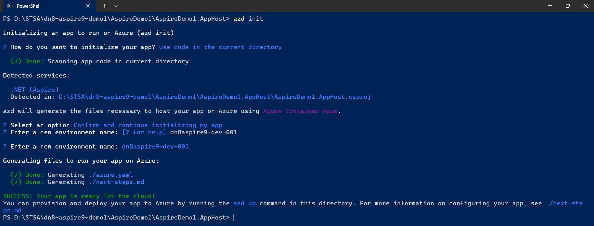

# .NET 8 Aspire 9 Sample

This is a sample project demonstrating .NET 8 and Aspire 9 features. The project showcases a distributed application architecture using .NET Aspire's orchestration capabilities.

## Project Structure

- **AspireDemo1.AppHost**: The orchestrator application that defines and configures the services
- **AspireDemo1.ApiService**: A weather forecast API service
- **AspireDemo1.Web**: A web frontend that consumes the API service
- **AspireDemo1.ServiceDefaults**: Shared service configuration defaults

## Reference Documentation

> 1. <https://learn.microsoft.com/en-us/dotnet/aspire/get-started/aspire-overview>
> 2. <https://learn.microsoft.com/en-us/dotnet/aspire/deployment/azure/aca-deployment>
> 3. <https://learn.microsoft.com/en-us/dotnet/aspire/deployment/azure/aca-deployment-github-actions?tabs=windows&pivots=github-actions>

## Deployment Images




### Subscription Level Deployment


### Resource Group Level Deployment


## Deployment Commands

Below are the key commands used to deploy this Aspire application to Azure Container Apps:

```powershell
# Initialize the Azure Developer CLI in the project
cd AspireDemo1\AspireDemo1.AppHost
azd init

# Generate the Aspire manifest file
dotnet run --project .\AspireDemo1.AppHost\AspireDemo1.AppHost.csproj --publisher manifest --output-path ../aspire-manifest.json

# Enable infrastructure synthesis feature
azd config set alpha.infraSynth on

# Generate infrastructure as code files
azd infra synth

# Authenticate with Azure
azd auth login --scope https://management.azure.com//.default

# Enable resource group level deployments
azd config set alpha.resourceGroupDeployments on

# Deploy the application to Azure
azd up
```

## Using an Existing Log Analytics Workspace

By default, the deployment creates a new Log Analytics workspace. If you want to use an existing workspace:

1. Get your existing Log Analytics workspace details:

   ```powershell
   # Get the workspace ID and customer ID
   $workspace = Get-AzOperationalInsightsWorkspace -Name "YourWorkspaceName" -ResourceGroupName "YourResourceGroup"
   $workspaceId = $workspace.ResourceId
   $customerId = $workspace.CustomerId

   # Get the workspace key
   $sharedKey = (Get-AzOperationalInsightsWorkspaceSharedKey -ResourceGroupName "YourResourceGroup" -Name "YourWorkspaceName").PrimarySharedKey
   ```

2. Set environment variables for the deployment:

   ```powershell
   azd env set EXISTING_LOG_ANALYTICS_WORKSPACE_ID $workspaceId
   azd env set EXISTING_LOG_ANALYTICS_WORKSPACE_CUSTOMER_ID $customerId
   azd env set EXISTING_LOG_ANALYTICS_WORKSPACE_SHARED_KEY $sharedKey
   ```

3. Now run the deployment:
   ```powershell
   azd up
   ```

## Local Development

To run the application locally, use:

```powershell
cd AspireDemo1
dotnet run --project .\AspireDemo1.AppHost\AspireDemo1.AppHost.csproj
```

This will start the Aspire dashboard and all services locally.
